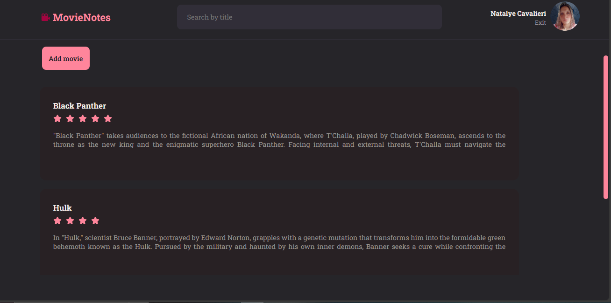
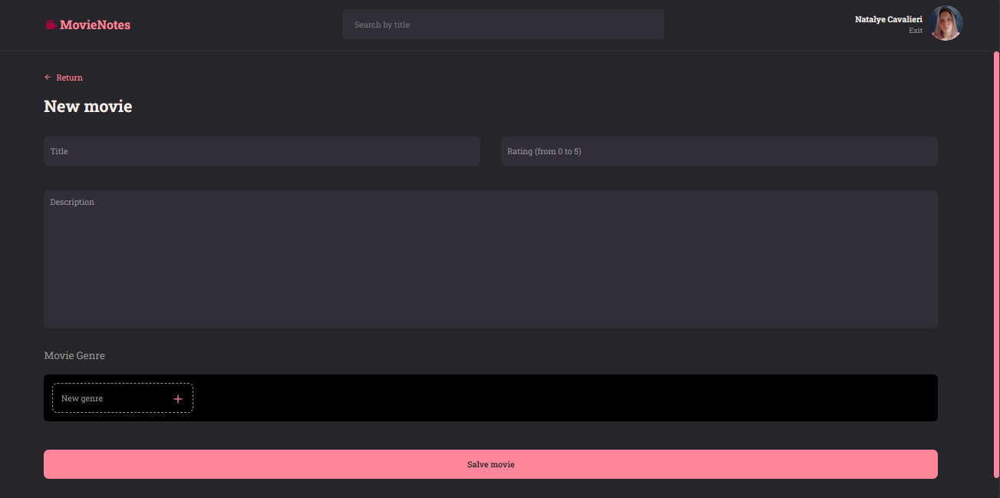
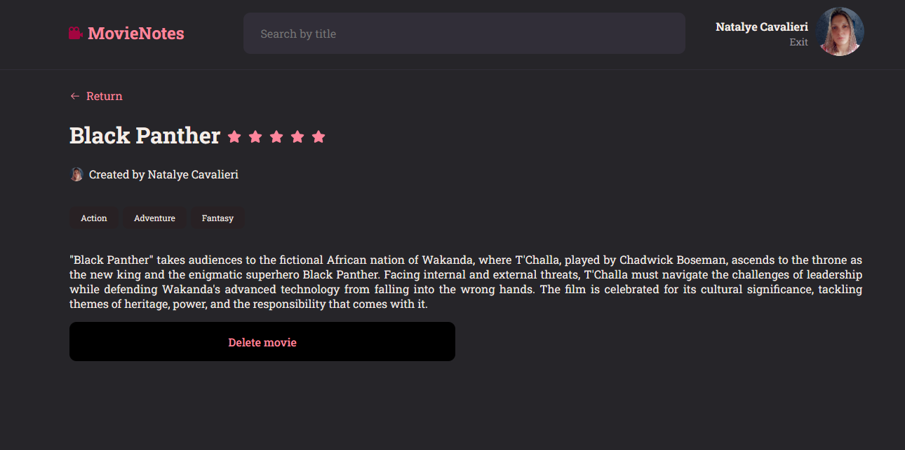

<h1 align="center">MovieNotes</h1>

Welcome to MovieNotes - Your app to keep notes on watched movies!

> Status: under development 🚧

<h4 align="center">SingUp page</h4>

<h4 align="center">SingIn page</h4>

<h4 align="center">Home page</h4>

<h4 align="center">Profile page</h4>

<h4 align="center">New movie notes page</h4>

<h4 align="center">Movie note details page </h4>

## Project Overview

MovieNotes is a project developed to facilitate the storage and organization of notes about movies. With a simple and intuitive interface, users can record titles, ratings, descriptions, and genres of watched movies.

## Key Features

- **Adding Movie Notes**: Easily add notes about the movies you've watched, including title, rating, description, and genre.
- **Organization**: Organize your notes for easy reference and review.

## Technologies Used

- **React and React-DOM**: Library for building user interfaces.
- **Vite**: Framework for rapid development of React projects.
- **Styled-Components**: Library for styling React components.
- **Axios**: HTTP client for making requests to the API.
- **Eslint**: Tool for identifying and correcting code patterns.
- **@types/react and @types/react-dom**: Typings for React.
- **react-icons**: Icon library for React.
- **react-router-dom**: Routing for navigation between pages.

## Directory Structure

- **src/components**: Reusable React components.
- **src/pages**: Main pages of the application.
- **src/routes.jsx**: Route configuration for authenticated and non-authenticated users.
- **src/services**: Services such as Axios for interaction with the API.
- **src/styles**: Global styles and themes.

## Project Pages

- **SignIn**: Login page.
- **SignUp**: Registration page.
- **Home**: Main page displaying notes on movies.
- **Details**: Page with details of the created note for a movie.
- **New**: Page for creating a new note about a movie.
- **Profile**: User profile page.

## Routes

Routes are defined in the `src/routes.jsx` file. There are specific routes for authenticated and non-authenticated users.

## Contribution

Contributions are welcome! Feel free to open issues and pull requests.
